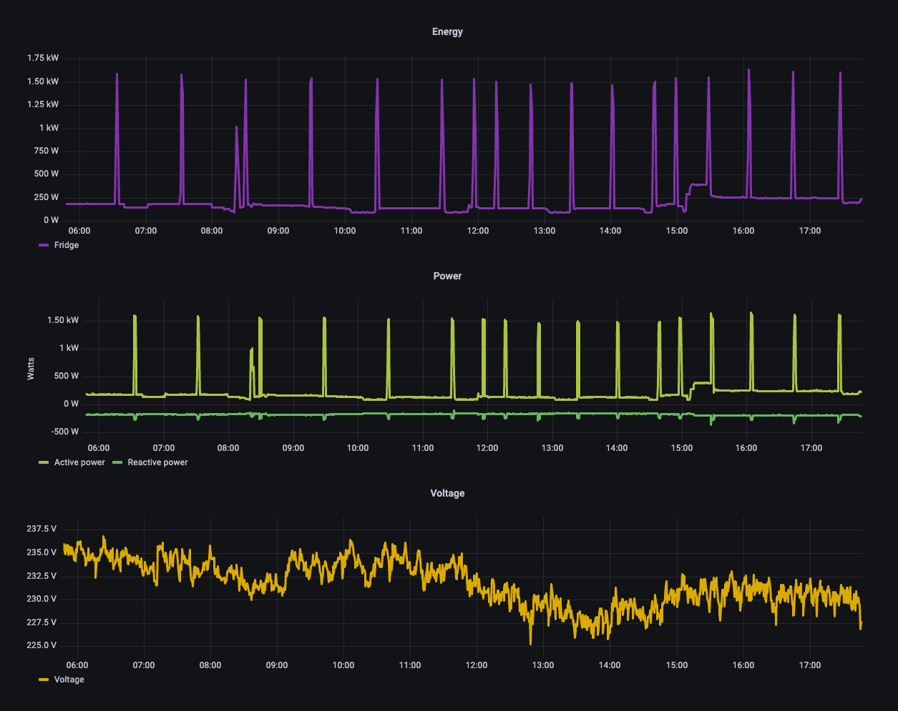

# qilisensors
Code managing the collection, storage and monitoring of the data coming from the sensors in the lab

## Usage

1. Connect Shelly sensor to local network
2. Configure mqtt protocol and server IP from Shelly's configuration GUI
3. Deploy docker services:
`docker-compose up -d`
4. Connect to graphana on `localhost:port`
5. Configure data source to InfluxDB `emeter` 
6. Upload json configuration of the dashboard

